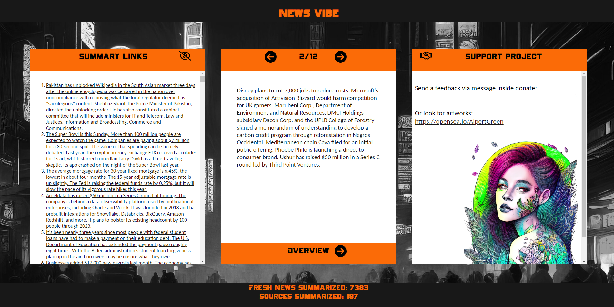
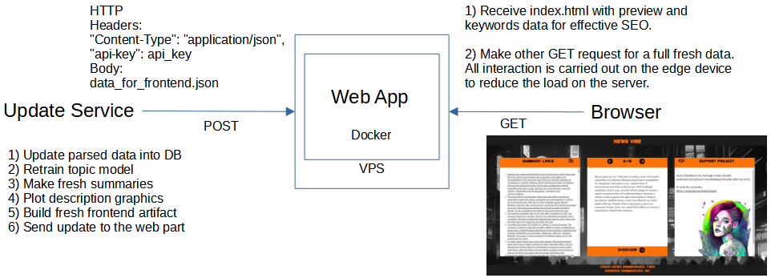

# Preview



# About

Data scrapping, processing and updating frontend part of my news analyzing service.
Project grew up from fully reworked ProfitTM (https://github.com/CameleoGrey/ProfitTM).



# Installation

```
git clone https://github.com/CameleoGrey/newsvibe_update_service_public_version.git
conda create -n newsvibe_update_service_env python=3.10
conda activate newsvibe_update_service_env
pip3 install torch==1.13.0+cu117 torchvision==0.14.0+cu117 torchaudio===0.13.0+cu117 -f https://download.pytorch.org/whl/cu117/torch_stable.html
pip install -r requirements.txt
python -m spacy download en_core_web_sm
```

Copy valid_api_keys.txt from newsvibe_web_app/data/valid_api_keys.txt to newsvibe_update_service/data/production/.
Place your proxy proxy_login:password@proxy_pool_ip:port into ./src/scripts/run_update_pipeline.py and run the script.